# DPDP Kavach: Full Architectural Plan
## Hackathon Track: Swatantra (Open / Any Indic AI Use Case)

---

## 1. Restated Problem

India's DPDP Act, 2023 creates cascading, continuous compliance obligations for any entity that processes digital personal data. The obligations are not a checklist — they are operational requirements that must be embedded into how a business collects data, stores it, shares it, and deletes it. The gap between the law and current practice is widest for India's 63 million MSMEs, its developer community, and its startup ecosystem — precisely the entities that have no compliance budget, no DPO, and no legal team.

The existing market either serves enterprises (too expensive, requires a legal org to implement) or serves curiosity (chatbots that explain the law without closing the gap). Neither produces the operational artifacts a business needs to actually become compliant.

DPDP Kavach is not a chatbot. It is a compliance infrastructure system. It discovers what personal data a business actually processes, maps those practices against DPDP obligations and sector-specific legal conflicts, generates every artifact the business needs to close the gap, and monitors for drift as data practices evolve.

---

## 2. Track Justification

This sits in Swatantra because it does not cleanly fit the others. It is not BNS law (Nyaya-Sahayak). It is not transport infrastructure (Rail-Drishti). It overlaps with Digital-Artha's financial inclusion angle — MSMEs being locked out of digital commerce because they cannot demonstrate DPDP compliance to enterprise partners or investors — but the scope is wider than fintech. Swatantra allows the full scope: any Indian business processing personal data.

The Indic AI angle is non-decorative. Every generated artifact must be available in the business's operating language. A kirana store owner in Nagpur should receive their Section 5 notice in Marathi. A clinic in Chennai should receive their consent implementation guide in Tamil. IndicTrans2 and Param-1 are core to the value proposition, not bolted on for bonus points.

---

## 3. System Architecture Overview

```mermaid
flowchart TD
    subgraph INPUT["Input Layer"]
        A1[Database Schema\nDDL / ORM / CSV headers]
        A2[Code Repository\nGitHub URL / ZIP upload]
        A3[API Spec\nOpenAPI / Swagger / GraphQL]
        A4[Guided Questionnaire\nFallback for non-technical users]
    end

    subgraph DISCOVERY["Discovery Engine — PySpark"]
        B1[Schema Parser\nExtract tables, columns, types, FK relationships]
        B2[Code Scanner\nPattern matching on form fields, SDK imports, API routes]
        B3[PII Pattern Matcher\nRegex + fuzzy match on field names and value samples]
        B4[Vendor Fingerprinter\nSDK imports → known third-party data practices]
    end

    subgraph KNOWLEDGE["Knowledge Layer — Delta Lake"]
        C1[(DPDP Obligation Index\nSections indexed by data category + purpose)]
        C2[(PII Taxonomy Table\nField names, value patterns, DPDP categories)]
        C3[(Sector Conflict Table\nRBI, SEBI, MoHFW, RTE cross-law mappings)]
        C4[(Vendor Intelligence Table\nSDK fingerprints, DPA availability, residency status)]
        C5[(Artifact Audit Log\nAll scans, versions, generated kits)]
        C6[(MLlib Model Store\nTrained purpose classifier + experiment metadata)]
    end

    subgraph TRAINING["ML Training — Spark MLlib + MLflow"]
        T1[Schema Co-occurrence Feature Engineering\nTable/column n-grams, FK graph, sibling tokens]
        T2[Co-occurrence Classifier Training\nLogistic Regression vs GBT, CrossValidator tuning]
        T3[MLflow Experiment Log\nParams, metrics, model artefacts per training run]
    end

    subgraph RETRIEVAL["Retrieval Layer — FAISS on DBFS"]
        D1[DPDP Act Full Text Index\nEmbedded by section, searchable by obligation type]
    end

    subgraph CLASSIFICATION["Classification + Obligation Mapping — PySpark + MLlib"]
        E1[Data Category Classifier\nPersonal / Sensitive / Children's / Employee]
        E2[Purpose Inferencer\nRule-based + MLlib model for ambiguous inputs]
        E3[Legal Basis Mapper\nSection 6 consent vs Section 7 legitimate use]
        E4[Conflict Detector\nCross-reference sector conflict table, flag contradictions]
        E5[Penalty Exposure Calculator\nSchedule to Act × gap severity × mitigating factors]
    end

    subgraph GENERATION["Generation Layer — Param-1 / Sarvam-m + IndicTrans2"]
        F1[Section 5 Notice Generator]
        F2[Section 6 Consent Package Generator\nHTML/JS and React]
        F3[Section 8 Retention + Erasure Policy Generator\nCron job / Spark scheduled job]
        F4[DPA Template Generator\nPer-vendor, pre-filled]
        F5[Section 9 Children's Data Package]
        F6[Breach Response Playbook Generator]
        F7[Compliance Register Generator]
        F8[IndicTrans2 Multilingual Wrapper\n22 Indian languages]
        F9[Artifact Grounding Verifier\nFAISS cosine similarity → per-claim confidence scores]
    end

    subgraph MONITORING["Monitoring Layer — Databricks Scheduled Jobs + MLflow"]
        G1[Schema Watcher\nWebhook / scheduled scan on schema changes]
        G2[Retention Enforcement Monitor\nDashboard of records approaching / past deadline]
        G3[MLflow Compliance Tracker\nScan history, classifier versions, generation audit trail]
    end

    subgraph OUTPUT["Output Layer — Databricks App"]
        H1[Compliance Kit Download\nZIP with all artifacts]
        H2[Grievance Intake Demo\nSection 11-14 request handling workflow]
        H3[Compliance Dashboard\nGap status, grounding-derived scores, upcoming deadlines]
    end

    A1 & A2 & A3 & A4 --> B1 & B2 & B3 & B4
    B1 & B2 & B3 & B4 --> C1 & C2 & C3 & C4
    T1 --> T2 --> T3 --> C6
    C6 --> E2
    C1 & C2 & C3 & C4 --> E1 & E2 & E3 & E4 & E5
    D1 --> E3 & E4
    E1 & E2 & E3 & E4 & E5 --> F1 & F2 & F3 & F4 & F5 & F6 & F7
    F1 & F2 & F3 & F4 & F5 & F6 & F7 --> F8
    F8 --> F9
    F9 --> H1
    D1 --> F9
    C5 --> G2
    G1 & G2 --> G3
    G3 --> H3
    H1 & H2 & H3 --> OUTPUT
```



---

## 4. Layer-by-Layer Technical Specification

---

### 4.1 Input Layer

The system accepts four input modes, in order of richness of discovery output.

**Mode 1: Schema Upload**
Accepted formats: `.sql` DDL files, Django `models.py`, Prisma `schema.prisma`, SQLAlchemy model files, `.csv` (headers + sample rows), `.json` schema files, MongoDB collection exports. The parser extracts table names, column names, data types, nullable flags, foreign key relationships, and index definitions. Foreign key relationships are critical: a `user_id` foreign key joining a `transactions` table to a `health_conditions` table means financial data and health data are linked at the database level, which changes the legal basis requirements entirely.

**Mode 2: Code Repository Scan**
Input is a GitHub URL (public repo) or a ZIP upload. The scanner clones or unpacks the repository and runs static analysis across all files. It does not execute any code. It performs pattern matching on Python and JavaScript/TypeScript files to extract: HTML form field names and types, React form definitions, API route handler request body schemas, import statements checked against the vendor intelligence table, third-party SDK initialisation calls, and environment variable names (which often reveal what services are connected). Python files are parsed using Python's `ast` module for reliable extraction; other languages are handled by regex patterns targeting common form field, import, and routing constructs. This is honest pattern matching — fast, deterministic, and sufficient to identify SDK presence and common field names, which is what the downstream classification needs.

**Mode 3: API Spec Upload**
Accepted formats: OpenAPI 3.x YAML/JSON, Swagger 2.x, GraphQL schema SDL. The parser extracts every request and response schema, identifies fields marked as required versus optional, and maps them against the PII taxonomy. This mode is particularly useful for backend developers who have documented their APIs even if they don't have a separate database schema file.

**Mode 4: Guided Questionnaire**
The fallback for non-technical users — a shop owner, a clinic administrator, a coaching institute manager. Not a free-text box. A structured decision tree: what type of business, what channels (physical, web, mobile, WhatsApp), what data categories collected (yes/no per category from a plain-language list), what third parties involved (payment, delivery, marketing, analytics — shown as recognisable brand names, not technical categories), whether any users are under 18, whether any employees' data is processed separately. Each answer narrows the obligation set. The output of the questionnaire is the same structured JSON inventory as the other three modes — the downstream pipeline is identical regardless of input mode.

---

### 4.2 Discovery Engine (PySpark)

All discovery processing runs as PySpark jobs. This satisfies the hackathon's requirement that Spark does real computational work.

**Schema Parser**
Reads uploaded schema files using PySpark's file reading utilities. Produces a structured DataFrame with columns: `table_name`, `column_name`, `data_type`, `is_nullable`, `has_foreign_key`, `fk_target_table`, `fk_target_column`. A second pass builds a relationship graph: which tables are joined to which, and therefore which data categories are co-located or linkable at query time. This graph is stored as a Delta table for downstream consumption.

**PII Pattern Matcher**
Joins the schema DataFrame against the PII Taxonomy Delta table (described in section 4.3) using two matching strategies. The first is exact and fuzzy name matching: column names like `phone`, `mobile_number`, `ph_no`, `contact`, `mob` all map to the mobile number PII category, handled via a fuzzy string match with a configurable similarity threshold. The second is value-pattern matching: for CSV uploads and database connections, a sample of actual values (100 rows, never stored permanently) is tested against regex patterns for Aadhaar numbers (12-digit with standard formatting variants), PAN numbers, mobile number formats, email patterns, PIN codes, GPS coordinate ranges, and date-of-birth formats. Column names that the name matcher could not classify are classified by their value patterns.

**Code Scanner**
Uses Python's `ast` module for Python files and regex-based pattern matching for JavaScript, TypeScript, and other languages. Extraction targets: form field `name` attributes, `state` variable names in React components that hold user input, API route `body` schema definitions, `import` and `require` statements cross-referenced against the vendor fingerprint table. This is deterministic pattern matching — it catches common field names, SDK initialisation patterns, and environment variable references reliably. Each extracted element is tagged with its source file and line number for auditability.

**Vendor Fingerprinter**
The vendor intelligence Delta table maps SDK package names and import patterns to known data collection practices. For example, `firebase/analytics` maps to: event tracking (behavioural), device identifiers (device fingerprint), approximate location if enabled, session data. `razorpay` maps to: payment card data (encrypted at Razorpay's end, but PAN and contact shared with the business), transaction amounts. Each vendor entry includes: what data they collect, whether they have a published DPA India businesses can sign, their data residency commitments, and their DPDP compliance status as of the last update. The fingerprinter joins every detected import against this table and appends vendor data collection entries to the data inventory.

---

### 4.3 Knowledge Layer (Delta Lake)

All reference data is stored as Delta tables. Delta Lake provides ACID transactions, time travel for audit purposes, and efficient predicate pushdown for the classification queries.

**DPDP Obligation Index**
One row per DPDP obligation, with columns: `section_number`, `sub_section`, `obligation_type` (notice / consent / retention / erasure / breach_notification / grievance / children / SDF_specific), `triggered_by_data_category` (array), `triggered_by_purpose` (array), `triggered_by_data_subject_type` (array), `legal_basis_options` (array), `penalty_if_breached` (from the Schedule), `full_text`. This table is the core mapping that drives the obligation engine. It is built by parsing the DPDP Act full text, which we have, with section boundaries identified and structured into rows.

**PII Taxonomy Table**
One row per PII pattern, with columns: `pii_category` (e.g., `mobile_number`, `health_condition`, `biometric`, `precise_location`, `financial_account`, `children_data`, `aadhaar`, `pan`), `dpdp_sensitivity_level` (`personal` / `sensitive`), `common_column_names` (array of known field names), `value_regex_pattern`, `dpdp_sections_triggered` (array), `legal_basis_required`, `retention_guidance`. This table is built by manual curation during the hackathon, with India-specific identifiers — Aadhaar format variants, PAN patterns, UPI handles, and Indian mobile number formatting — supplemented by common field name patterns drawn from open-source Indian project schemas on GitHub.

**Sector Conflict Table**
One row per regulatory conflict, with columns: `sector` (fintech / healthtech / edtech / ecommerce / general), `conflicting_regulation` (e.g., `RBI_KYC_Master_Direction_2016`), `conflicting_section` (e.g., `Section_16_ten_year_retention`), `dpdp_section` (e.g., `Section_8_7_erasure`), `conflict_type` (`DPDP_stricter` / `sector_reg_stricter` / `direct_contradiction`), `resolution_guidance`, `citation_dpdp`, `citation_sector_reg`. This table is built manually during the hackathon using publicly available regulatory texts. It is not large — the most significant conflicts number in the dozens — but it is high-value because no automated tool currently surfaces these conflicts with citations on both sides.

**Vendor Intelligence Table**
One row per vendor/SDK, with columns: `package_name` (array of import variants), `vendor_name`, `data_collected` (array of PII categories), `dpa_available` (boolean), `dpa_url`, `data_residency_india` (boolean), `residency_notes`, `section_8_2_compliant` (boolean), `tracking_behavioral` (boolean), `children_data_collected` (boolean), `last_verified_date`. Built from published vendor privacy policies, DPA documents, and GDPR/DPDP compliance declarations.

**Artifact Audit Log**
One row per compliance scan, with columns: `scan_id`, `business_id`, `timestamp`, `input_mode`, `data_inventory_hash` (SHA-256 of the discovered inventory), `obligations_triggered` (array), `conflicts_detected` (array), `artifacts_generated` (array), `language`, `mlflow_run_id`, `purpose_classifier_version` (the MLlib model version used for purpose inference in this scan). Delta Lake's time travel allows a business to retrieve any previous compliance scan — relevant if the Board asks when a business first assessed its obligations.

**MLlib Model Store**
Stores the trained co-occurrence classifier artefacts and their metadata. Columns: `model_version`, `training_dataset` (synthetic schema dataset version), `algorithm` (Logistic Regression or GBT, whichever cross-validation selected), `f1_score`, `precision`, `recall`, `training_timestamp`, `mlflow_run_id`, `model_path_dbfs`. Every production classification run references this table to load the correct model version. MLflow logs the corresponding experiment run. This table is the link between the training pipeline and the inference pipeline — it is what makes the classifier reproducible and auditable.

---

### 4.4 Retrieval Layer (FAISS on DBFS)

One FAISS index is built and stored on DBFS. It is queried during the obligation mapping phase to ground the classification in actual legal text, and during the generation phase to provide precise section references in the generated artifacts. It is also used by the Artifact Grounding Verifier (section 4.7) to score per-claim confidence after generation.

**DPDP Act Index**
The full DPDP Act text is split into chunks at the sub-section level. Each chunk is embedded using a sentence-transformer model (all-MiniLM-L6-v2, CPU-compatible, ~90MB). The FAISS index enables semantic search: given a classified data inventory item — for example, "health condition data collected for telemedicine, shared with partner hospitals" — the retrieval query finds the most relevant DPDP sections (Section 6(1) for consent requirements, Section 8(2) for the Data Processor contract requirement, Section 8(7) for erasure obligations). The retrieved text is passed as context to the generation layer so the generated artifacts cite accurate section numbers and language. Sector-specific legal text (RBI, MoHFW) is not indexed in FAISS; the Sector Conflict Delta table handles cross-law lookups with structured joins, which is faster and more precise for the enumerable set of known conflicts than semantic retrieval.

---

### 4.5 ML Training Pipeline (Spark MLlib + MLflow)

This section covers the one genuine Spark ML training job in the system. Its purpose is narrow and honest: train a purpose classifier that handles the cases the rule-based classifier cannot — ambiguous column and table names where pattern matching produces a low-confidence or no-match result.

**Why this is needed**
The rule-based PII and purpose classification covers the large majority of real-world schemas. A column named `phone_number` in a table named `customers` classifies deterministically. The problem is the long tail: tables named `info`, `data`, `records`, columns named `val1`, `entry`, `field_a`. These appear in legacy systems and MSME-built databases more often than in developer-built systems. The critical insight is that the signal for classifying an ambiguous column is not its name — it is the company the column keeps. A column `field_a` in a table that also has `dob`, `guardian_name`, and `school_code` is almost certainly children's data. The same `field_a` alongside `order_id`, `amount`, and `utr_number` is almost certainly financial data. The MLlib classifier exploits this co-occurrence structure.

**Training Data: Synthetic Schema Dataset**
Training data is generated synthetically from real-world database schemas in open sources — GitHub public repositories, Kaggle dataset CSVs, and open-source Indian project ORM schemas. PII columns are labelled manually per schema. Approximately 600–800 labelled column examples are sufficient for this feature space. The labelled dataset is loaded into a Delta table and version-controlled for reproducibility.

**Feature Engineering (PySpark)**
The feature engineering job runs as a PySpark transformation pipeline. For each column to be classified, the feature vector is constructed from:
1. The target column name, tokenised using character n-grams (handles abbreviations like `usr_trx`, `ph`, `mob`).
2. All sibling column names in the same table, tokenised and aggregated into a single feature set.
3. The table name, tokenised using the same character n-gram approach.
4. The column data type (encoded as a categorical feature).
5. Whether the column has a foreign key, and the character n-gram tokens of the FK target table name.
6. The table's position in the schema graph: hub table (many incoming foreign keys) vs. leaf table (few or none).

None of these features require reading privacy policy prose. They are all derivable from the schema file, making the classifier applicable to any schema regardless of documentation quality. The feature pipeline uses `Tokenizer`, `NGram`, `HashingTF`, and `VectorAssembler` from Spark MLlib.

**Model Training**
Two classifiers are trained and compared using `CrossValidator` with 5-fold cross-validation:
- `LogisticRegression` with L2 regularisation, `regParam` grid: [0.01, 0.1, 1.0].
- `GBTClassifier` with `maxDepth` grid: [3, 5] and `maxIter` grid: [20, 50].

The `Pipeline` API chains the feature transformers and the classifier so the entire pipeline — including pre-processing — is a single serialisable model artefact. `CrossValidator` selects the best model by F1 score (macro-averaged across PII purpose categories). The winning model is saved to DBFS and registered in the MLlib Model Store Delta table.

**MLflow Experiment Logging**
Every training run logs to MLflow: the training dataset version (synthetic schema Delta version), the algorithm and hyperparameters selected by cross-validation, the F1, precision, and recall scores per class, the confusion matrix as an artefact, and the model path on DBFS. The `purpose_classifier_version` field in the Artifact Audit Log references the `model_version` from the MLlib Model Store, linking every production classification scan to the exact model version that performed the inference.

**Production Inference**
The trained pipeline is loaded at classification time using `PipelineModel.load(model_path)`. When the rule-based classifier returns `confidence < threshold` for a data element, the element's schema context is passed to the MLlib model for a prediction. The prediction is appended to the data inventory with a `classifier_source: mllib` flag and the model's probability score. High-confidence rule-based classifications are never overridden — the MLlib model fills gaps, it does not compete with deterministic matches.

**Demo moment**: the judge sees a column classified as `UNCLASSIFIED` by the rule-based name matcher. The co-occurrence classifier then correctly infers its category from its table siblings and FK context. The MLflow log shows the model version, its training F1 score, and the probability score for this inference. This makes the ML contribution visible and concrete — the classifier is solving a problem the rule-based system demonstrably cannot.

---

### 4.6 Classification and Obligation Mapping (PySpark + Spark MLlib)

This is the computational core of the system. All classification runs as PySpark jobs.

**Data Category Classifier**
Takes the raw discovery output DataFrame and joins it against the PII Taxonomy Table using Spark's broadcast join (the taxonomy table is small enough to broadcast). For each discovered data element, assigns: `pii_category`, `sensitivity_level`, `data_subject_type_inference` (inferred from context — a `student_grade` column alongside a `date_of_birth` column infers minor data subjects), and a `confidence_score`. Low-confidence classifications are flagged for manual review in the output.

**Purpose Inferencer**
Uses table names and column co-occurrence patterns to infer processing purpose. A table called `orders` with columns `product_id`, `quantity`, `delivery_address`, `payment_status` clearly serves transaction fulfilment. A table called `campaign_clicks` with columns `user_id`, `ad_id`, `timestamp`, `device_type` clearly serves marketing analytics. Where the rule-based classifier returns a low-confidence result — ambiguous table names like `info` or `records`, legacy column names like `val1` or `field_a` — the schema context is passed to the MLlib purpose classifier trained in section 4.5. The MLlib model produces a prediction and a probability score; both are logged against the data element. Purpose inference matters because it determines which legal basis under Section 7 is available and what retention period is appropriate.

**Legal Basis Mapper**
For each classified data element and inferred purpose, maps the available legal bases: Section 6 consent, or one of the Section 7 legitimate uses. The mapping rules are: processing for marketing requires Section 6 consent (Section 7 does not cover it). Processing for order fulfilment can use Section 7(a) where the Data Principal voluntarily provided data. Processing for statutory compliance uses Section 7(d). Processing for employment uses Section 7(i). Where consent is the only available legal basis, the mapper flags that a valid Section 6 consent mechanism is mandatory — not optional.

**Conflict Detector**
For each business sector identified from the input (inferred from the data categories discovered — health data implies healthtech, payment data implies fintech), joins against the Sector Conflict Table. Retrieves all conflicts applicable to this business's sector and data categories. For each conflict, records: the DPDP obligation, the conflicting regulation, the nature of the conflict, and the recommended resolution. Conflicts are classified as blocking (cannot comply with both laws simultaneously without a documented exception) or advisory (tension exists but a compliant path is available).

**Penalty Exposure Calculator**
For each identified compliance gap — a data category collected without a valid consent mechanism, a retention period with no documented basis, a vendor relationship without a Section 8(2) contract — maps the gap to the relevant penalty item in the Schedule to the Act. Assigns a severity multiplier based on the Section 29 factors: whether the gap is ongoing vs. historical, whether sensitive personal data is involved, whether children's data is involved, whether the business has taken any mitigating action. Produces a maximum exposure figure and a current exposure figure (maximum discounted by mitigating factors). This number is surfaced prominently in the compliance dashboard. It is the number that makes the cost of inaction concrete without requiring the business to read the Act.

---

### 4.7 Generation Layer (Param-1 / Sarvam-m + IndicTrans2)

All generation uses quantized Indian language models running on CPU. The key design principle is that the LLM receives a fully structured, verified data inventory as input — not a free-text description. It is filling legal language around known facts, not inferring what those facts are. This constrains hallucination to the language layer rather than the factual layer.

Artifacts are generated in English by the language model (using FAISS-retrieved DPDP section text as grounding), then translated to the business's operating language by IndicTrans2. Param-1 (2.9B, quantized) handles the guided questionnaire response interpretation and Indic-language dashboard alerts, where it is used natively for Hindi and regional language inference. Sarvam-m handles compact inference where latency matters most. IndicTrans2 translation of full artifacts is treated as an async batch step given its CPU latency — artifacts are available in English immediately and Indic translations follow within the same session.

Each artifact is generated as a separate inference call, keeping individual context windows manageable for CPU-based quantized models. The generation prompt for each artifact includes: the relevant DPDP sections retrieved from FAISS (as grounding), the specific data elements applicable to this artifact, the business's sector, any relevant conflicts identified, and the output format specification. MLflow logs every generation call: model version, prompt hash, output hash, generation timestamp. This provides a complete audit trail.

**Section 5 Notice Generator**
Input: full classified data inventory, retrieved DPDP sections for notice obligations, business name and sector. Output: a complete, DPDP-compliant privacy notice that lists every personal data category discovered (not self-reported), the specific purpose for each, the legal basis for each, the retention period for each, the third parties data is shared with and why, the Data Principal's rights under Sections 11-14, how to exercise each right, the grievance officer contact, and how to make a complaint to the Board. The notice is structured to satisfy Section 5(1)(i), (ii), and (iii) explicitly.

**Section 6 Consent Package Generator**
Input: data categories requiring consent, purposes requiring separate consent toggles, business's technology stack (web/mobile/hybrid, detected from the code scanner). Output: a complete consent implementation package. For web: HTML markup and vanilla JavaScript for the consent banner, with separate toggle per purpose, purpose description per toggle, withdrawal mechanism, and a backend API call stub for logging consent. For React: a self-contained `ConsentBanner` component with the same features. For WhatsApp Business flows (relevant for MSMEs that collect data via WhatsApp): a template message sequence. The package also includes the database schema for the consent log table — the evidence store required under Section 6(10).

**Section 8(7) Retention and Erasure Policy Generator**
Input: data inventory with purposes, inferred or declared retention periods, any conflict table entries for this business. Output: a retention policy document and an executable erasure job. The retention policy documents each data category, its retention period, the legal basis for that period, and the erasure trigger (purpose completion, consent withdrawal, or prescribed time period under Section 8(8)). The executable job is a PySpark script (or a cron-compatible Python script for smaller businesses) that queries each relevant table for records past their retention deadline and either deletes them or moves them to a legally-mandated archive partition with documented legal basis. Where a conflict exists (RBI's ten-year retention vs. DPDP's erasure obligation), the job implements a two-partition approach: an active data partition under DPDP rules and an archived partition under the sector regulation, with the archive access-restricted and clearly annotated with its legal basis.

**Data Processing Agreement Template Generator**
Input: vendor intelligence entries for all detected third-party vendors. Output: one DPA template per vendor, pre-filled with the vendor's known data collection scope, the business's specific use case for that vendor, the obligations under Section 8(2), the audit rights, the sub-processor disclosure requirements, the breach notification obligations back to the Data Fiduciary, and the data deletion obligations on contract termination. Where a vendor does not have a published DPA (flagged in the vendor intelligence table), the generator produces a complete DPA the business can send to the vendor to sign — not just a flag that one is needed.

**Section 9 Children's Data Package Generator**
Triggered whenever the classifier identifies data subjects likely to include minors — student data, parental consent records, age fields with values suggesting minors, educational institution context. Output: age verification flow implementation (a documented reasonable measure, not a claim of foolproof verification), parental consent collection flow consistent with Section 9 of the DPDP Act, a flag and removal script for any detected analytics SDK that performs behavioural tracking (Firebase Analytics, Mixpanel, CleverTap by default perform behavioural tracking — Section 9(3) categorically prohibits this for children's data regardless of consent), and a data minimisation checklist specific to children's data.

**Breach Response Playbook Generator**
Input: business size (inferred from data volume and structure), data categories present, sector. Output: a documented breach response procedure covering: internal detection and triage steps, the obligation to notify the Board under Section 8(6) and the required notification content, the obligation to notify affected Data Principals and the required notification content, a timeline template (Board notification is required within a prescribed period, not yet specified in rules but currently expected to mirror GDPR's 72-hour precedent), evidence preservation steps, and a post-breach remediation checklist.

**Compliance Register Generator**
Output: a structured document covering every processing activity, its legal basis, its purpose, its data subjects, its data categories, its retention period, its third-party processors and their DPA status, its applicable DPDP obligations, and the current compliance status of each obligation. This is the document the Board would request in any inquiry. Having it pre-generated, structured, and current is the difference between a business that can demonstrate compliance and one that cannot.

**IndicTrans2 Multilingual Wrapper**
Every generated artifact passes through IndicTrans2 before delivery. The wrapper maintains a legal terminology glossary: DPDP-specific terms (Data Fiduciary, Data Principal, Consent Manager, Significant Data Fiduciary, Data Protection Board) are not translated but transliterated and defined in parentheses at first use. Procedural legal language (shall, must, within a reasonable time, upon withdrawal of consent) is translated using verified legal translation equivalents, not generic language model translations. The glossary is a Delta table maintained and version-controlled. Supported output languages: Hindi, Marathi, Tamil, Telugu, Kannada, Malayalam, Bengali, Gujarati, Punjabi, Odia — the languages covering the largest share of India's MSME population.

**Artifact Grounding Verifier**
After generation and translation, each artifact passes through a grounding verification step. This is the second ML component in the system and it solves a real problem: the generation layer is grounded by FAISS-retrieved context at input time, but there is no guarantee that the generated text stays close to that legal source. The verifier checks this after the fact.

For each substantive claim in the artifact — each obligation statement, each rights description, each retention rule — the verifier embeds the claim sentence using the same all-MiniLM-L6-v2 sentence-transformer used to build the DPDP Act FAISS index. It then queries the FAISS index for the top-3 closest DPDP Act chunks and computes the cosine similarity between the claim embedding and each retrieved chunk. If the maximum similarity across the top-3 falls below a configurable threshold (default: 0.65), the claim is flagged as low-confidence and surfaced in the compliance dashboard as requiring manual review before relying on it.

This produces a per-claim grounding score for every generated artifact. The compliance dashboard's overall compliance score is derived from this: the fraction of obligation statements in all generated artifacts that are well-grounded in retrieved Act text. A score of 0.85 means 85% of obligation claims in the compliance kit have FAISS cosine similarity ≥ 0.65 against the DPDP Act text. This is an honest, computable metric — not an arbitrary weighted formula — and it directly answers the question a judge will ask: how do you know the generated artifacts are accurate?

The demo payoff: the compliance kit preview shows each obligation statement colour-coded by grounding confidence. Green (≥ 0.80), amber (0.65–0.80), red (< 0.65, flagged for review). A judge looking at this understands immediately that the system knows what it knows and what it doesn't — which is what distinguishes a compliance tool from a hallucinating chatbot.

---

### 4.8 Monitoring Layer (Databricks Scheduled Jobs + MLflow)

**Schema Watcher**
Integrates with source control via webhook (GitHub/GitLab) or runs as a scheduled Databricks job against a connected database. On each trigger, re-runs the schema parser and PII classifier on the changed elements only (incremental processing using Delta Lake's change data feed). Compares the new inventory against the previous version stored in the Artifact Audit Log. If new PII categories are introduced, new obligations are triggered, or existing obligations are newly violated, an alert is generated: which data element changed, what new obligation it triggers, which artifact needs to be updated.

**Retention Enforcement Monitor**
A Databricks dashboard (part of the Databricks App output layer) showing: records approaching their retention deadline (configurable warning window, defaulting to 30 days before deadline), records past their retention deadline still present in the system (a live compliance gap requiring immediate action), the erasure job run history and outcomes, and the archive partition status for legally-mandated long-retention data. This dashboard is the operational interface for ongoing compliance — the thing a business checks regularly rather than once.

**MLflow Compliance Tracker**
Every compliance scan is logged as an MLflow experiment run. Parameters logged: input mode, number of data elements discovered, number of PII categories classified, number of obligations triggered, number of conflicts detected, model versions used for generation, `purpose_classifier_version` referencing the MLlib Model Store entry. Metrics logged: classification confidence scores, penalty exposure calculated (before and after kit implementation), count of rule-based vs MLlib-classified elements. The MLflow experiment log gives judges a visible, reproducible audit trail of every scan and every classifier version used — it is the evidence of both AI operation and Databricks usage in a single place.

---

### 4.9 Output Layer (Databricks App)

The user-facing interface is a Databricks App. It has three sections.

**Compliance Kit Download**
After a scan completes, the business downloads a ZIP file containing all generated artifacts: the privacy notice (PDF and plain text), the consent implementation package (code files organised by stack), the retention policy document, the erasure job script, one DPA template per detected vendor, the children's data package if triggered, the breach response playbook, and the compliance register. Each file is available in English and the business's selected operating language.

**Grievance Intake Demo**
A section of the Databricks App that demonstrates the Section 11–14 request-handling workflow. A sample request form (information access, correction or erasure, grievance, nomination) is pre-filled with demo data and submitted through the pipeline. Submitted requests are recorded with timestamps in the Artifact Audit Log. This demonstrates the concept of a grievance mechanism being operational — which is what matters for the demo. An externally accessible portal for real Data Principals is explicitly out of scope: Databricks Apps require workspace authentication and cannot serve external end-users of a client business.

**Compliance Dashboard**
A real-time view of the business's compliance posture. The overall compliance score is derived from the Artifact Grounding Verifier: the fraction of obligation statements across all generated artifacts that achieve cosine similarity ≥ 0.65 against DPDP Act text in the FAISS index. Breakdown by obligation type (notice, consent, retention, breach response, grievance) shows the per-category grounding scores alongside gap status. The dashboard also shows penalty exposure estimate, outstanding gaps sorted by severity, upcoming retention deadlines, and a timeline of compliance scan history. Fed by the Artifact Grounding Verifier, the MLflow Compliance Tracker, and the Retention Enforcement Monitor.

---

## 5. Databricks Mandatory Requirements Mapping

| Requirement | How DPDP Kavach Satisfies It |
|---|---|
| Databricks as core | All discovery, classification, ML training, conflict detection, and monitoring runs as PySpark jobs. Delta Lake stores six structured tables. Schema watcher runs as a Databricks scheduled job. FAISS indices stored on DBFS. Spark is doing the actual computational work — PII classification via broadcast join, purpose classification via a trained MLlib pipeline, obligation mapping, pattern matching at scale — not just file storage. |
| AI must be central | The schema co-occurrence classifier (trained on synthetic schema data using Spark MLlib), the artifact grounding verifier (FAISS cosine similarity scoring per claim), the RAG retrieval (FAISS + sentence-transformers), and the artifact generation (Param-1 / Sarvam-m) are the product. Without AI, there are no classified inventories, no grounding scores, and no generated artifacts. The MLlib component is a genuine Spark MLlib training job with cross-validation and MLflow experiment logging — not the LLM layer dressed up as ML. |
| Prefer Indian models | Param-1 (2.9B, quantized, CPU-compatible) handles Indic-language questionnaire inference and dashboard alerts. Sarvam-m handles compact inference where speed matters. IndicTrans2 handles all multilingual artifact translation. All three are from the provided resource list with clearly separated, non-overlapping roles. |
| Working demo | The demo path is: upload a sample database schema (provided as a demo file in the repo) → Spark classification runs (rule-based + MLlib for ambiguous elements) → FAISS retrieval grounds the output → model generates artifacts → grounding verifier scores each claim → compliance kit downloads as ZIP → judge opens the consent banner HTML in a browser. Every step is reproducible from the GitHub repo. The cluster must be pre-warmed before the demo; cold start on Free Edition is 3–5 minutes and this should be stated honestly in the demo notes. |
| Databricks App or Notebook UI | The Databricks App serves as the primary interface with three sections: Kit Download, Grievance Intake Demo, and Compliance Dashboard. Alternatively, a Gradio front-end deployed on Databricks provides the same interface if the App submission runs into Free Edition constraints. |

---

## 6. Delta Lake Table Schema (Detailed)

### `dpdp_obligation_index`
```
section_number       STRING
sub_section          STRING
obligation_type      STRING
triggered_by_data_category  ARRAY<STRING>
triggered_by_purpose        ARRAY<STRING>
triggered_by_data_subject   ARRAY<STRING>
legal_basis_options         ARRAY<STRING>
penalty_max_crore           DECIMAL(10,2)
penalty_schedule_item       INTEGER
full_text                   STRING
```

### `pii_taxonomy`
```
pii_category              STRING
dpdp_sensitivity_level    STRING           -- personal / sensitive
common_column_names       ARRAY<STRING>
value_regex_pattern       STRING
sections_triggered        ARRAY<STRING>
legal_basis_required      STRING
retention_guidance        STRING
children_data_flag        BOOLEAN
biometric_flag            BOOLEAN
financial_flag            BOOLEAN
health_flag               BOOLEAN
```

### `sector_conflict`
```
sector                    STRING
conflicting_regulation    STRING
conflicting_section       STRING
dpdp_section              STRING
conflict_type             STRING
resolution_guidance       STRING
citation_dpdp             STRING
citation_sector_reg       STRING
last_verified_date        DATE
```

### `vendor_intelligence`
```
package_names             ARRAY<STRING>
vendor_name               STRING
data_collected            ARRAY<STRING>
dpa_available             BOOLEAN
dpa_url                   STRING
data_residency_india      BOOLEAN
residency_notes           STRING
section_8_2_compliant     BOOLEAN
tracking_behavioral       BOOLEAN
children_data_collected   BOOLEAN
last_verified_date        DATE
```

### `artifact_audit_log`
```
scan_id                   STRING
business_id               STRING
timestamp                 TIMESTAMP
input_mode                STRING
inventory_hash            STRING
obligations_triggered     ARRAY<STRING>
conflicts_detected        ARRAY<STRING>
artifacts_generated       ARRAY<STRING>
language                  STRING
mlflow_run_id             STRING
purpose_classifier_version STRING
penalty_exposure_max      DECIMAL(12,2)
penalty_exposure_current  DECIMAL(12,2)
```

### `mllib_model_store`
```
model_version             STRING
training_dataset          STRING           -- synthetic_schema_v1
algorithm                 STRING           -- LogisticRegression or GBTClassifier
f1_score_macro            DECIMAL(5,4)
precision_macro           DECIMAL(5,4)
recall_macro              DECIMAL(5,4)
training_timestamp        TIMESTAMP
mlflow_run_id             STRING
model_path_dbfs           STRING
is_current_production     BOOLEAN
```

---

## 7. Open Datasets Used

| Dataset | Source | How Used |
|---|---|---|
| DPDP Act 2023 full text | Gazette of India (provided) | FAISS index, obligation table construction |
| Synthetic schema dataset | Generated from open-source GitHub repos and Kaggle schemas, manually labelled | MLlib co-occurrence classifier training corpus |
| RBI Master Direction on KYC 2016 | RBI website | Sector conflict table (fintech retention conflict) |
| MoHFW Telemedicine Guidelines 2020 | MoHFW website | Sector conflict table (healthtech obligations) |

All datasets are open source or publicly available government documents. No proprietary data is used. The vendor intelligence table is a static curated dataset built during the hackathon from publicly available vendor privacy policies and DPA documents; no automated update mechanism is in scope.

---

## 8. Indic AI Integration Points (Non-Decorative)

Every integration of Indian models serves a specific, non-overlapping functional role:

**Param-1 (2.9B, quantized)**: Handles the guided questionnaire response interpretation and Indic-language dashboard alert generation. Used natively for Hindi and regional language inference in these contexts, where it is responding in the language the user is operating in rather than translating.

**Sarvam-m**: Handles compact inference where speed and latency matter more than generation length — primarily the classification confidence summaries and alert text for the monitoring dashboard.

**IndicTrans2**: Translates all generated artifacts from English to the business's selected operating language. The legal glossary (Delta table, version-controlled) is applied as a post-processing step after translation, overriding generic translations of defined DPDP terms with verified equivalents. Translation runs as an async batch step due to CPU latency on full-document translation.

---

## 9. What the Demo Proves

The demo is designed to prove three things in sequence.

First, that discovery is real. The judge uploads a sample database schema file (provided in the GitHub repo as a demo input). The cluster must be pre-warmed before the demo — cold start on Free Edition takes 3–5 minutes and this is stated in the demo setup notes. With the cluster running, the Spark job executes, the PII classifier runs, and a classified data inventory appears on screen: every table, every column, every PII category, every obligation triggered. The judge did not type anything except uploading a file. For any column that produced a low-confidence rule-based result, the MLlib co-occurrence classifier's prediction and probability score are shown alongside — demonstrating that the ML component is doing real inference work, not just pattern matching dressed up as AI.

Second, that generation is grounded. The compliance kit generates from the verified inventory. The Section 5 notice names the actual columns and tables from the schema — it is not a generic template. The consent banner has separate toggles matching the actual data categories discovered. The DPA template references the actual third-party SDK names found in the schema or code. The grounding verifier then scores each obligation statement in the generated artifacts by cosine similarity against the DPDP Act FAISS index. The judge sees the kit preview with colour-coded confidence: green (≥ 0.80), amber (0.65–0.80), red (< 0.65, flagged for review). This makes clear that the system knows what it can and cannot ground in the Act.

Third, that the cross-law conflict detection is real. The demo schema includes a fintech context — payment data alongside identity data. The conflict detector surfaces the RBI KYC retention conflict explicitly: DPDP Section 8(7) requires erasure, RBI Master Direction Section 16 requires ten-year retention, and here is how the generated retention policy handles both simultaneously, with citations to both regulatory instruments.

That sequence — discovery from a file, ML-backed classification for ambiguous inputs, generation from verified facts, grounding verification with per-claim confidence scores, and conflict detection with dual citations — is the pitch. It is concrete and immediately comprehensible to any judge who has read the Act.

---

## 10. Why This Wins

The judging criteria are: Databricks Usage (30%), Accuracy and Effectiveness (25%), Innovation (25%), Presentation and Demo (20%).

On Databricks Usage: Spark runs the PII classification pipeline and the MLlib purpose classifier training job. Delta Lake stores six structured tables that are actively queried — not just used for file storage. FAISS on DBFS handles semantic retrieval. MLflow tracks every scan, every classifier training run, and every generation call with full parameter and metric logging. The Databricks App delivers the UI. Every component justifies its presence if a judge asks "what is this actually computing."

On Accuracy and Effectiveness: The generated artifacts cite specific DPDP sections retrieved via FAISS — not hallucinated. The artifact grounding verifier scores every obligation statement by cosine similarity against the DPDP Act index, producing a per-claim confidence score that is visible in the demo. The conflict detection cites both regulations with specific section numbers. The consent implementation satisfies Section 6(1), (4), and (10) by design. The penalty exposure calculator uses the actual Schedule and Section 29 factors. The co-occurrence classifier's predictions are traceable to a logged MLflow experiment — not a black box.

On Innovation: No existing tool discovers actual data practices from a schema or codebase and generates compliant artifacts from verified facts. No existing tool surfaces cross-law conflicts between DPDP and sector regulations with citations on both sides at a price point accessible to MSMEs. The schema co-occurrence classifier — trained on schema topology rather than privacy policy prose — is the component that makes the system work for real-world legacy data: the poorly named columns, the inherited schemas, the abbreviated identifiers that constitute the actual compliance problem for India's MSME sector. The artifact grounding verifier, which self-audits every generated claim against the Act, is a genuinely novel addition that no existing compliance tool implements. Both the discovery-to-generation pipeline and the conflict detection with dual citations are genuinely novel.

On Presentation and Demo: The demo is a file upload followed by a visible pipeline running followed by a downloadable kit. It is reproducible, concrete, and requires no trust in narration. The penalty exposure number — surfaced prominently — is the number that makes the problem real for any judge in the room. The MLflow experiment log, visible during the demo, shows a training run and a scan run with logged parameters and metrics — answering the "where is the AI" question before it is asked.
