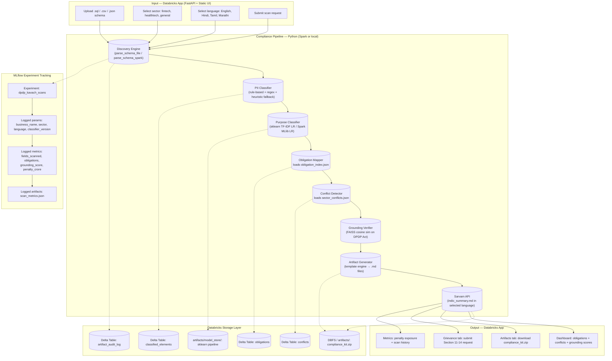

# DPDP Kavach

DPDP Kavach is a Databricks-native compliance intelligence app for Indian MSMEs. It scans schema/data inputs, classifies PII, runs MLlib-assisted purpose refinement, maps DPDP obligations, flags sector conflicts (RBI/telemedicine), computes grounding confidence using FAISS-backed vector retrieval (fallback supported), calls an Indian model path (Sarvam API when configured), logs scan runs to MLflow when available, writes scan outputs to Delta tables, and generates a downloadable compliance kit.

Current implementation audit is tracked in `GAP_AUDIT.md` (done vs remaining against `hackathon.md` and architecture spec).

## Architecture



## Repo Structure

- `app/main.py` FastAPI backend + static frontend host
- `src/dpdp_kavach/` compliance pipeline modules
- `web/` Vite frontend (shadcn-inspired UI), built output in `web/dist`
- `scripts/run_local_pipeline.py` local CLI pipeline run
- `scripts/databricks_pipeline.py` Spark + Delta pipeline job for Databricks
- `GAP_AUDIT.md` implementation gap tracker against hackathon requirements
- `data/demo_schema.sql` reproducible demo input
- `app.yaml` Databricks Apps runtime config
- `databricks.yml` Databricks bundle deployment config

## Local Run

Backend:
```bash
python3 -m venv .venv
. .venv/bin/activate
pip install -r requirements.txt
PYTHONPATH=.:src uvicorn app.main:app --host 0.0.0.0 --port 8000
```

Frontend (optional for local dev):
```bash
cd web
npm install
npm run dev
```

Production local flow serves built frontend from FastAPI:
```bash
cd web
npm install
npm run build
cd ..
PYTHONPATH=.:src uvicorn app.main:app --host 0.0.0.0 --port 8000
```

## Local CLI (non-UI)

```bash
PYTHONPATH=src python3 scripts/run_local_pipeline.py \
  --schema data/demo_schema.sql \
  --business "Demo MSME" \
  --sector fintech \
  --language English \
  --output artifacts
```

## Databricks Deployment

Prereq: valid Databricks CLI auth (`databricks auth profiles`).

```bash
databricks bundle validate
databricks bundle deploy -t dev
databricks bundle run dpdp-kavach -t dev
```

## Spark + Delta Job on Databricks

Run this as a Databricks job task (Python script task):

```bash
python scripts/databricks_pipeline.py \
  --schema /Workspace/Repos/<you>/<repo>/data/demo_schema.sql \
  --business "Demo MSME" \
  --sector fintech \
  --language English \
  --output /dbfs/tmp/dpdp-kavach
```

Delta outputs:
- `/dbfs/tmp/dpdp-kavach/delta/classified_elements`
- `/dbfs/tmp/dpdp-kavach/delta/obligations`
- `/dbfs/tmp/dpdp-kavach/delta/conflicts`
- `/dbfs/tmp/dpdp-kavach/delta/artifact_audit_log`

## Demo Steps (for judges)

1. Open deployed app.
2. Upload `demo_schema.sql`.
3. Run scan.
4. Show obligations + conflicts tabs.
5. Open grounding tab and explain confidence scoring.
6. Open artifacts tab and show `dpa_templates.md` in generated kit.
7. Show penalty exposure metric card in dashboard.
8. Open artifacts tab and download kit ZIP.
9. Submit a sample grievance request in the grievance tab (stored server-side).
10. Show audit JSON for reproducibility.

## Databricks + AI Usage

- **Databricks**: The live app scan path writes `classified_elements`, `obligations`, `conflicts`, and `artifact_audit_log` to Delta (`artifacts/delta_live/*`) using Spark; `scripts/databricks_pipeline.py` provides batch Spark execution too.
- **PII Classification**: Rule-based taxonomy (11 categories: aadhaar, pan, mobile_number, email, dob, health_data, financial_data, children_data, name, identifier, address) with regex value matching, plus heuristic fallback layer for common-but-unlisted column names (name tokens, address tokens, id patterns, demographic keywords). Classification sources: `rule:name`, `rule:value`, `heuristic:name`, `heuristic:address`, `heuristic:id`, `heuristic:demographic`, `default`.
- **Purpose Inference**: Domain-aware routing (payments, care_delivery, marketing, employment, education, commerce) + MLlib/sklearn logistic-regression TF-IDF classifier (720-sample training set) for ambiguous column names. Sector-blind on non-PII columns.
- **Indian model integration**: Set `SARVAM_API_KEY` to enable `sarvam-m` executive summary generation (`indic_summary.md`) in selected language.
- **Model/Audit traceability**: Scan response and Delta audit include `purpose_classifier_version`, `grounding_backend`, `mlflow_run_id`, `indian_model_name`, and `indian_model_status`.
